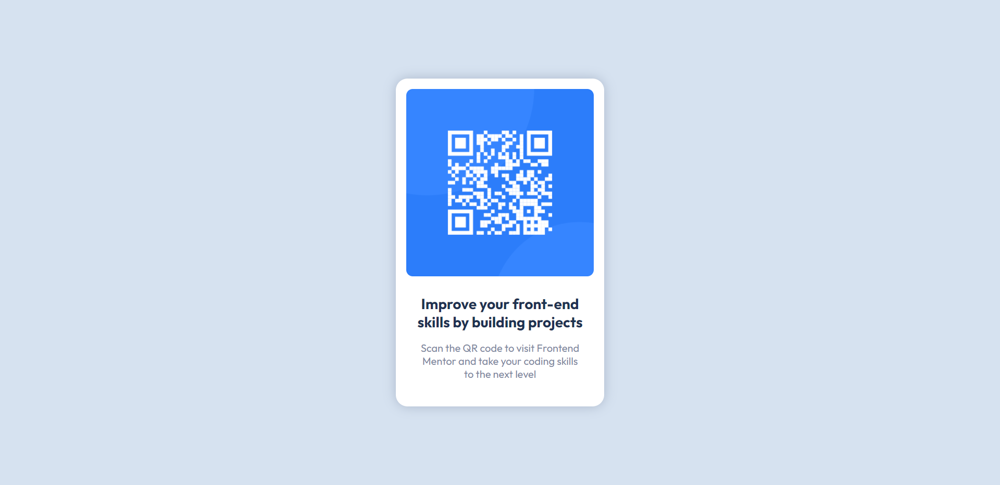

# 🤖 QR Code Component
QR Code Component Challenge from Frontend Mentor

## 🖼️ Screenshots



## 🚀 Usage
Clone the repository and open with live server

### Clone the repository
```shell
git clone https://github.com/JoseLuria/url-shortening-landing-page.git
```

## License

[MIT](https://opensource.org/licenses/MIT)
